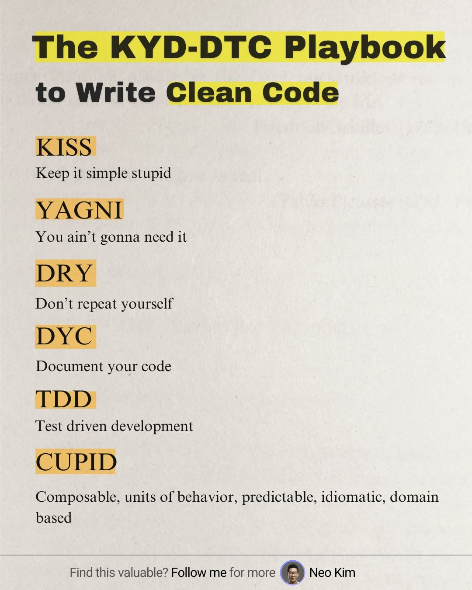

**👨‍🏫 Docente: Anderson Ocaña**  

**Módulo: Front End**

¡Bienvenidos/as al módulo de Front End! Durante esta cursada vamos a introducirnos en el desarrollo de interfaces web utilizando dos de los frameworks/librerías más utilizados en la industria: **Vue.js** y **React**.

📚 **Contenidos principales**:
- Fundamentos de JavaScript moderno (ES6+)
- Introducción a Vue.js: componentes, directivas, reactividad
- Introducción a React: JSX, estado, props, componentes funcionales
- Comparación entre enfoques de Vue y React
- Buenas prácticas y organización de proyectos front end

🎥 **Clases grabadas**  
Podés acceder a los videos de las clases desde el siguiente enlace:

🔗 [Link a la carpeta con los videos](https://drive.google.com/drive/folders/1QLHSiOT7G5bhvzvMARzk8mQ0mq7Z4Kra?usp=drive_link) 

## Un recordatorio para todos los programadores

📩 **Contacto**  
Ante cualquier duda, podés escribirme por el foro del aula o también a mi correo:  
✉️ [Correo institucional ORT](mailto:anderson.ocana@ort.edu.ar)

