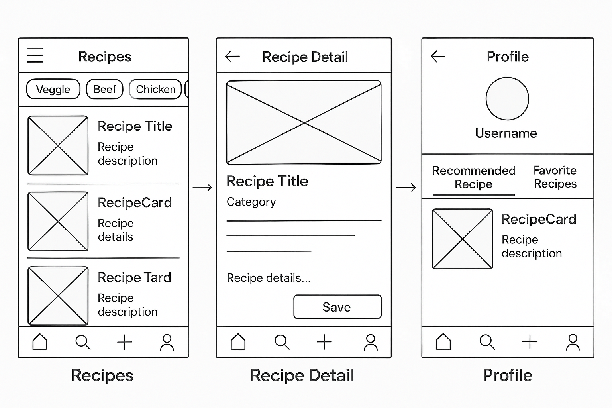

## Propósito del Proyecto : Recetario-App

Vamos a desarrollar una aplicación **ReactJS** que te recomienda recetas según el tipo de comida:

- 🍅 Veggie
- 🥩 Carnes 
- 🍗 Pollo 
- 🐟 Pescado.

### Fases del proyecto:

1. **Web App con React + Tailwind**
2. **Transformación a PWA usando Vite + VitePWA**
3. **Migración a mobile con React Native + Expo** (reutilizando lógica donde sea posible)

Además, tendrá sistema de login con **Supabase** y una base de datos real para manejar usuarios, recetas y favoritos.

---

## 🔥 De que se va a tratar esta app?

Queremos que cualquier usuario pueda:

* Navegar recetas por categoría.
* Si está logueado:

  * Guardar recetas como favoritas.
  * Elegir *una receta destacada* para mostrar en su perfil.
  * Ver sus recetas guardadas.

Este tipo de aplicación sirve para practicar:

* Autenticación real.
* Gestión de estado.
* Manejo de datos remotos (API/DB).
* Diseño modular de componentes.
* Navegación entre vistas/tabs.
---
### Wireframe Recetario App



---

## 🧱 Estructura (de carpetas aprox base)

```bash
src/
├── app/                 # Entry points, routing, layout base
├── components/          # Componentes atómicos/reusables
├── features/            # Cada feature o dominio agrupado
│   ├── auth/            # Login/Register/Profile
│   ├── recipes/         # Lista, detalle, favoritos, recomendadas
│   └── user/            # Info del usuario, receta destacada
├── hooks/               # Custom hooks (ej: useAuth, useRecipes)
├── lib/                 # Configs: Supabase, Tailwind helpers, etc.
├── pages/               # Si usás routing basado en file system.
├── constants/           # Datos inmutabales de mi proyecto.
├── services/            # Acceso a APIs o supabase
├── store/               # Estado global si lo necesitás
├── styles/              # Tailwind config o estilos extra
└── utils/               # Funciones utilitarias
```

## 🧱 Recomendado

```bash
src/
├── app/
│   ├── App.jsx
│   └── router.jsx
│
├── components/
│   ├── Navbar.jsx
│   └── RecipeCard.jsx
│
├── features/
│   ├── auth/
│   │   ├── pages/
│   │   │   ├── Login.jsx
│   │   │   └── Register.jsx
│   │   └── services/
│   │       └── auth.service.js
│   │
│   ├── recipes/
│   │   ├── pages/
│   │   │   ├── RecipeList.jsx
│   │   │   └── RecipeDetail.jsx
│   │   └── services/
│   │       └── recipe.service.js
│   │
│   └── user/
│       ├── pages/
│       │   └── Profile.jsx
│       └── services/
│           └── user.service.js
│
├── hooks/
│   └── useAuth.js
│
├── lib/
│   └── supabase.js
│
├── styles/
│   └── index.css
│
│
├── main.jsx
└── index.html

```


## 🎯 Goals

| Tema Vistos                  | Bolillas Basicas vistas                                                |
| ---------------------------- | ---------------------------------------------------------------------- |
| **Routing**                  | React Router DOM + estructura de navegación pensada en vistas/tab      |
| **Autenticación**            | Supabase con OAuth y Email/Password                                    |
| **Manejo de estado**         | Context API, custom hooks, o algo como Zustand si se quiere escalar    |
| **Diseño con Tailwind**      | Componentes desacoplados y reusables, mobile-first                     |
| **Acceso a datos**           | Supabase: `from`, `select`, `insert`, `update`                         |
| **Componentes**              | Atomic Design + patrón contenedor/presentacional                       |
| **PWA**                      | Qué es, cómo se convierte y por qué importa                            |
| **Migración a React Native** | Qué se puede portar, qué cambia, cómo usar Expo y dividir lógica de UI _(optional)_|

---

## 🗓️ Distribucion por stages

| Stages | Objetivo                                                                    |
| ------ | --------------------------------------------------------------------------- |
| 1      | Kickoff + Setup del proyecto (Vite, Tailwind, Supabase init)                |
| 2      | Diseño y navegación básica (categorías, layout base, routing)               |
| 3      | Integración Supabase: auth + registro/login                                 |
| 4      | CRUD de recetas + UI de listado por categoría                               |
| 5      | Favoritos y receta destacada en perfil                                      |
| 6      | Limpieza, refactor a componentes reusables, testing básico                  |
| 7      | PWA: Instalación, manifest, offline ready                                   |
| 8      | Introducción a React Native + migración del core (lógica y modelo de datos) |
